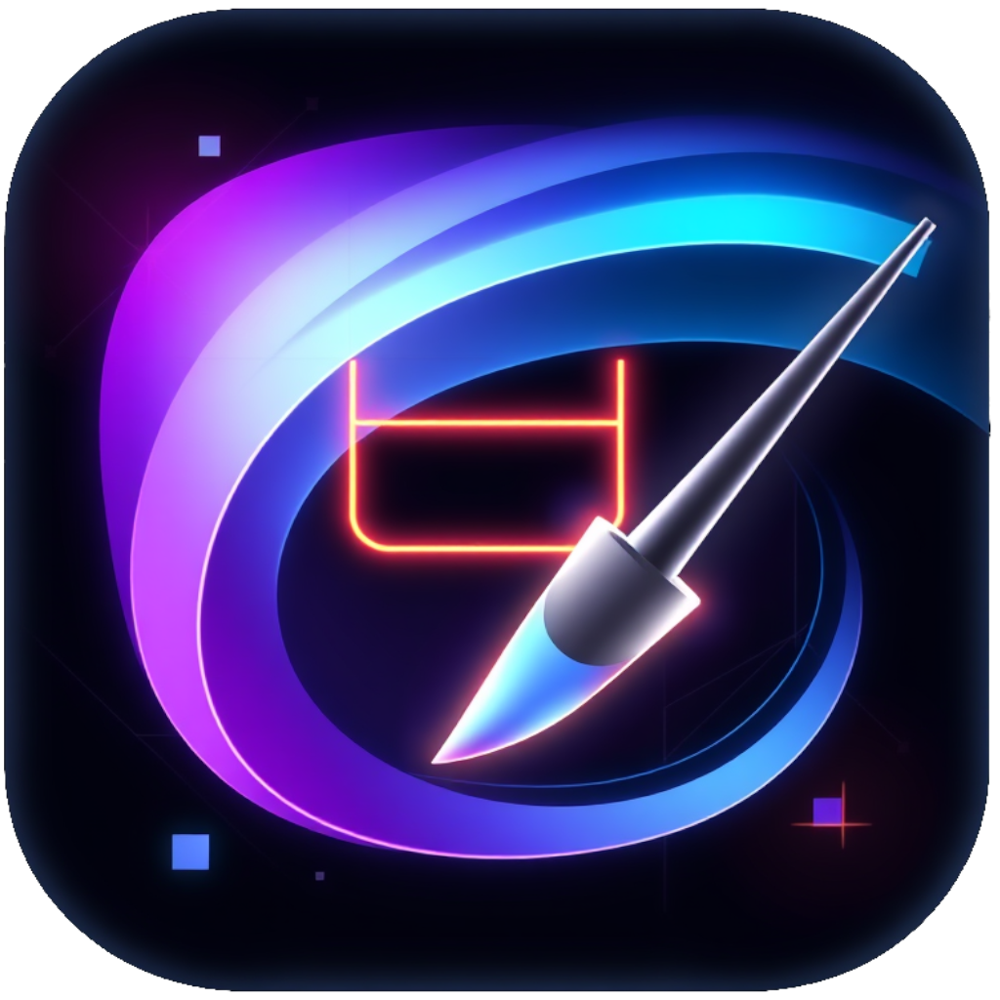

# FAL-AI Playground

<p align="center">
  
</p>

A Gradio-based application for experimenting with fal.ai models.

## Setup

### Using uv for dependency management

1. Install uv if you don't have it:

```bash
pip install uv
```

2. Create a virtual environment and install dependencies:

```bash
uv venv
uv pip install -r requirements.txt
```

3. Activate the virtual environment:

```bash
# On Linux/Mac
source .venv/bin/activate

# On Windows
.venv\Scripts\activate
```

## Running the application

```bash
python main.py
```

This will start the Gradio interface with tabs for inpainting and flux animation features.

## Features

- **Inpainting**: Upload an image, create a mask, and provide a prompt to fill in masked areas
- **Flux**: Generate animations based on text prompts
